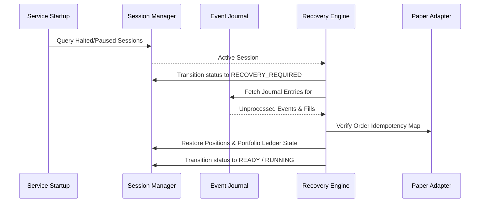

# Restart Recovery Engine Specification

## 1. Overview
The Restart Recovery Engine (`packages/paper/recovery.py`) restores Paper Trading session state following application restart, process crash, or network disconnect without creating duplicate orders or fills.

---

## 2. Recovery Workflow

---

## 3. Idempotency & Zero Duplicate Guarantee
- `PaperExchangeAdapter` maintains an in-memory & journal-backed index of `client_order_id`.
- Replayed order submission events return existing fills without generating new execution transactions.
- Portfolio ledger ignores duplicate fill IDs via `processed_fill_ids`.
